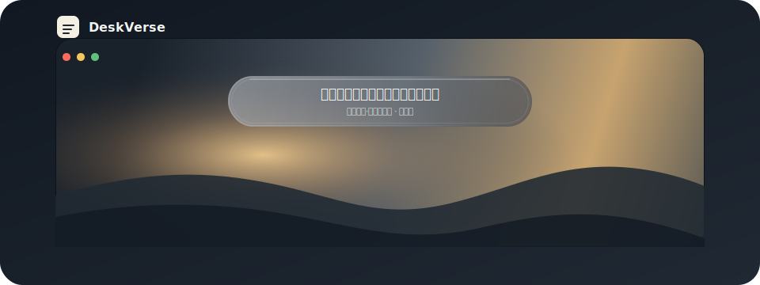

# DeskVerse

<p>
  English | <a href="README.zh-CN.md">简体中文</a>
</p>

**DeskVerse** is a quiet desktop verse widget for Windows.

It stays on your desktop, shows a short sentence or poem, adapts its colors from your wallpaper, and gets out of the way when you open other apps.

<p align="center">
  
</p>

## Features

- Native Windows WinForms app, no Electron or WebView.
- Low power usage: no continuous animation, no high-frequency polling.
- Subtle event animations for startup, refresh, copy, and favorite feedback.
- Single instance: launching it repeatedly will not open duplicate widgets.
- Switchable text sources:
  - [Hitokoto](https://developer.hitokoto.cn/sentence/)
  - [Jinrishici](https://www.jinrishici.com/doc/)
- Wallpaper-aware theme colors for background, text, metadata, and border.
- Auto refresh interval: 15 minutes, 30 minutes, 1 hour, daily, or locked.
- Position presets: top center, top left, top right, bottom center.
- Font size presets: small, medium, large.
- Copy and favorite the current sentence.
- Optional startup on login.
- Tray and right-click menus for common actions.

## Requirements

- Windows 10 or later
- [.NET 9 SDK](https://dotnet.microsoft.com/download) for development
- .NET 9 Desktop Runtime for framework-dependent published builds

## Download

Download the latest build from [Releases](https://github.com/RuiAuspicious/DeskVerse/releases).

Two Windows x64 packages are produced:

- `DeskVerse-win-x64-framework-dependent.zip`: smaller, requires .NET 9 Desktop Runtime.
- `DeskVerse-win-x64-self-contained.zip`: larger, runs without installing .NET separately.

## Run From Source

```powershell
dotnet run
```

## Build

```powershell
dotnet build -c Release
```

## Test

```powershell
dotnet run --project tests/DeskVerse.Tests/DeskVerse.Tests.csproj -c Release
```

## Publish

Framework-dependent single-file build:

```powershell
dotnet publish -c Release -r win-x64 --self-contained false /p:PublishSingleFile=true
```

Output:

```text
bin\Release\net9.0-windows\win-x64\publish\DeskVerse.exe
```

Self-contained single-file build:

```powershell
dotnet publish -c Release -r win-x64 --self-contained true /p:PublishSingleFile=true
```

## Usage

- Double-click the widget to refresh.
- Right-click the widget or tray icon to open the menu.
- Use `Settings` to change refresh interval, position, and font size.
- Use `Copy current sentence` or `Favorite current sentence` to keep a line you like.
- Use `Startup on login` to enable or disable auto start.

## Local Data

DeskVerse stores local settings and favorites under:

```text
%AppData%\DeskVerse\settings.json
%AppData%\DeskVerse\favorites.json
%AppData%\DeskVerse\logs\
```

Jinrishici requires a client token. DeskVerse stores that token in `settings.json` so it does not request a new token on every launch.

Logs are local only and are used to diagnose startup, wallpaper, and network failures.

## Privacy

DeskVerse does not collect telemetry and does not upload your settings or favorites.

Network requests are limited to the text source you choose:

- Hitokoto when `Hitokoto` is selected.
- Jinrishici when `Jinrishici` is selected.

Wallpaper color matching reads your local wallpaper file only on your machine.

## API Notes

Hitokoto:

```text
https://v1.hitokoto.cn/?encode=json&max_length=42
```

Jinrishici:

```text
https://v2.jinrishici.com/token
https://v2.jinrishici.com/sentence
```

Please keep refresh intervals respectful. DeskVerse defaults to 30 minutes.

## License

MIT
